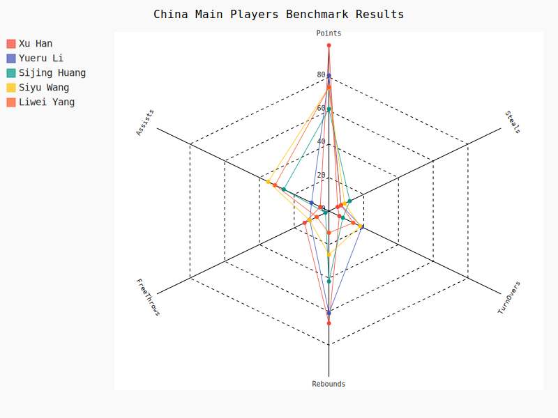
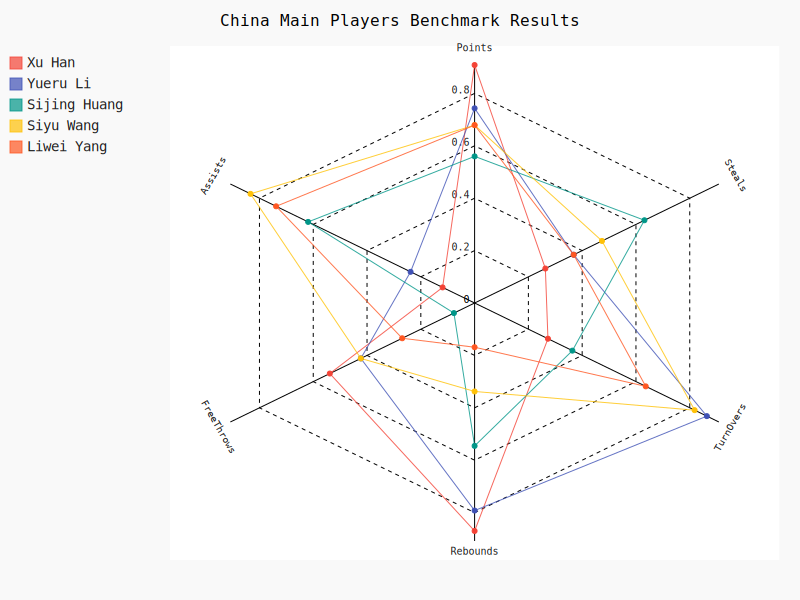

# Women Basket World Cup 2022 - All Players Data Analysis

## 1 Get and save all players data to local
    https://www.fiba.basketball/womensbasketballworldcup/2022/playerstats
  python script : getPlayersData.py save output as 'women_basket_world_cup_2022_all_players.json'  

## 2 Preprocessing data
   download file is json file, to use pandas library, we need convert json file to csv.\
   we need the following change for convert data.\
   1 add new column as Team.\
   2 add new column 'ReboundsTotal',get value from DefensiveReboundsTotal and OffensiveReboundsTotal

## 3 Player data analysis
### 3.1 Top 10 players by efficiency 

The graph is created based on the efficiency of the players. Efficiency is one of the most important critera to 
test a player's value, and it is culculated by a formula, which contains many different data from multiple aspects, 
so I chose this index to create the graph. Base on the graph, there are several conclusions we can get.\
First, most directly, we can see the ranking of the players based on efficiency and who were the top ten. \
Second, although the top one player has the highest efficiency, not all of her data is the top one of the game. For example, 
the total points her got was not the highest. This further reflects that efficiency is a comprehensive index.

### 3.2 Player Compare 
Top 5 China Player Compare
This radar graph presents the datas of five players, Xu Han, Yueru Li, Sijing Huang, Liwei Yang, and Siyu Wang, from China.
The data includes points, steals, turnovers, rebounds, freethrows,and assists because these are the most essential 
criterion to judge whether the player is efficient on the court. 

When I first created the graph by showing all the real and original data, the graph is inconvenient to observe 
because the range for different data is different. To solve this problem, I used sklearn.preprocessing imported from
MinMaxScaler to standardize all the data so that the range of the data would all be one, which is more convenient for us
to make conclusions.

By looking at this graph, we can find out who has the advantage in all of these areas: \
Xu Han got the most points, rebounds, and freethrows. However, she got the least assists, steals, and turnovers, which are
the areas that Han should improve on.\
Sijing Huang got the most steals and least steals and points within these five players. Huang should improve the strategies 
about how to get more points in a game.\
Yueru Li got the most turnovers and her ranking of rebounds is second, which is also her advantage. Yet, her steals,
assists, and freethrows are all medium in team China.\
Siyu Wang got the most assists and ranked second in turnovers. Nevertheless, Wang's steals, rebounds, and freethrows
are at medium in team China, and she can improve on these aspects.\
Liwei Yang's advantage is in assistance. She is ranking number two in assists. Yang can create opportunities for her
teammates to get points, which is also the basis of winning a game. As the captain of team China, Yang doesn't necessarily
need to be the top of the team, instead, she provides mental support for the team.

In conclusion, since the points and rebounds are the most important part of a game, Xu Han is definitely the most 
valuable and excellent player from China.

Han vs Wilson

## 4 Team data analysis
Team China box data

Team USA box data

Team JPN box data

## 5 conclusion

