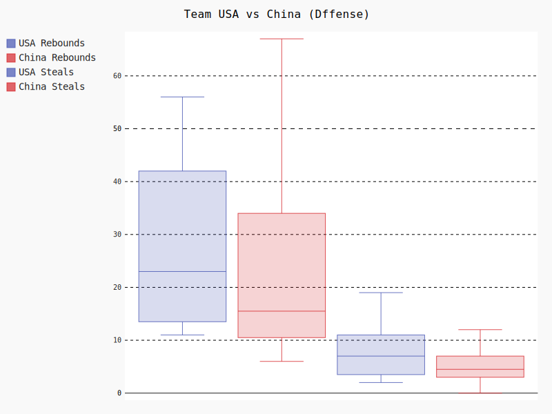
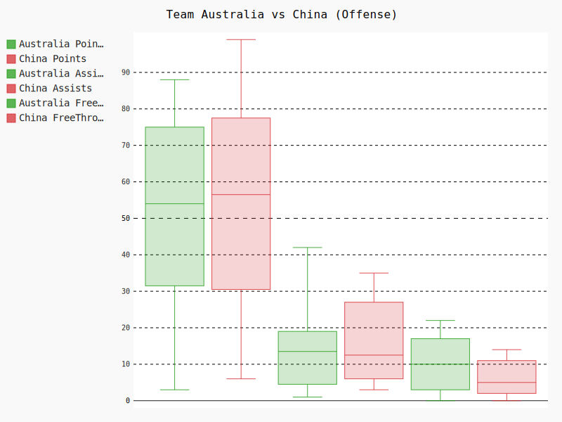
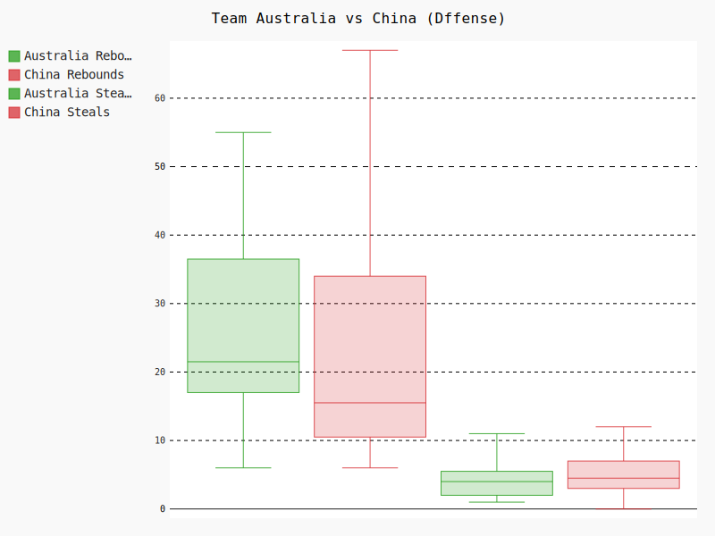

# Women Basket World Cup 2022 - All Players Data Analysis

## 1 Get and save all players data to local
   get data from FIBA website -- Women Basket World Cup 2022, save output as 'women_basket_world_cup_2022_all_players.json'  
   https://www.fiba.basketball/womensbasketballworldcup/2022/playerstats
   
  Process by getPlayersData.py

## 2 Preprocessing data
   download file is json, to use pandas library, we need convert json file to csv.\
   we need the following change for convert data.\
   1 add new column as Team.\
   2 add new column 'ReboundsTotal', get value from DefensiveReboundsTotal and OffensiveReboundsTotal

Process by preProcessingPlayerData.py

## 3 Player data analysis
### 3.1 Top 10 players by efficiency 

Generated by showTop10PlayersByEfficiency.py

The graph is created based on the efficiency of the players. Efficiency is one of the most important critera to 
test a player's value, and it is culculated by a formula, which contains many different data from multiple aspects, 
so I chose this index to create the graph. Base on the graph, there are several conclusions we can get.\
First, most directly, we can see the ranking of the players based on efficiency and who were the top ten. \
Second, although the top one player has the highest efficiency, not all of her data is the top one of the game. For example, 
the total points her got was not the highest. This further reflects that efficiency is a comprehensive index.

### 3.2 Player Compare 
Top 5 China Player Compare
This radar graph presents the datas of five players, Xu Han, Yueru Li, Sijing Huang, Liwei Yang, and Siyu Wang, from China.
The data includes points, steals, turnovers, rebounds, freethrows,and assists because these are the most essential 
criterion to judge whether the player is efficient on the court. 

Generated by comparePlayersBenchmark-no-stand.py

When I first created the graph by showing all the real and original data, the graph is inconvenient to observe 
because the range for different data is different. To solve this problem, I used sklearn.preprocessing imported from
MinMaxScaler to standardize all the data so that the range of the data would all be one, which is more convenient for us
to make conclusions.

Generated by comparePlayersBenchmark.py

By looking at this graph, we can find out who has the advantage in all of these areas: \
Xu Han got the most points, rebounds, and freethrows. However, she got the least assists, steals, and turnovers, which are
the areas that Han should improve on.\
Sijing Huang got the most steals and least steals and points within these five players. Huang should improve the strategies 
about how to get more points in a game.\
Yueru Li got the most turnovers and her ranking of rebounds is second, which is also her advantage. Yet, her steals,
assists, and freethrows are all medium in team China.\
Siyu Wang got the most assists and ranked second in turnovers. Nevertheless, Wang's steals, rebounds, and freethrows
are at medium in team China, and she can improve on these aspects.\
Liwei Yang's advantage is in assistance. She is ranking number two in assists. Yang can create opportunities for her
teammates to get points, which is also the basis of winning a game. As the captain of team China, Yang doesn't necessarily
need to be the top of the team, instead, she provides mental support for the team.

In conclusion, since the points and rebounds are the most important part of a game, Xu Han is definitely the most 
valuable and excellent player from China.

Xu Han is the greatest and the most vauable player in team China during the 2022 World Cup. The greatest player of the
whole 2022 World Cup is A'Ja Wilson from team USA. By comparing these two players, we can see what is the difference
between China and the world, and how or what to improve.

Generated by comparePlayerBenchmark.py

We can see that the graph is also standardized so that the ranges of data would be one.
According to the graph, Wilson has an advantage than Han in points, steals, and freethrows, especially in steals and 
freethrows because Wilson's data exceeds Han by a lot. Han's assists, turnovers, and rebounds are better than Wilson.
If Han wants to catch up the top player of the world, she should improve on her steals, freethrows, and try to get more 
points.

## 4 Team data analysis
### 4.1 Team China vs Team USA
Team USA vs China box data in Offense

Generated by compareTeamBenchmarkChinaToUSOffense.py

This graph shows the comparison of data during the offense between Team USA and Team China. The data includes points, assists, 
and freethrows made. These are the critical data reflecting the ability of the team during offense. USA and China are the
first place and second place of the 2022 Women's Basketball World Cup. In the graph, in each column, we can see the
maximum and minimum, average value, and the first and third quartiles. The box in the middle represents the middle 50% of 
the data By analyzing this graph, we can directly see the difference between them so that the teams can find out where 
to improve.

In the points column, both the minimum and maximum point Team USA got is higher than China. The average points Team USA got
is three points higher than Team China. In the assists column, the maximum value of Team China has one more than Team USA,
but the average value of assists of Team USA is 1.5 larger than China. In the last column, freethrows made, Team USA exceeds
China by a lot. Team USA's average has 5 more freethrows than Team China. Therefore, we can see that China need to improve their
offense ability especially in freethrows and points earned.

Team USA vs China box data in Defense

Generated by compareTeamBenchmarkChinaToUSDefense.py
This graph shows the comparison of data during the defense between Team USA and Team China. The data includes rebounds, 
and steals. These are the crucial data reflecting the performance of a team in defense. As a box graph, the content of the graph
is the same as the offense graph. 

In the rebounds column, the maximum of China is higher than USA. However, the minimum, average value, and the quartlies 
of China are all lower than USA. The player in China got the most rebounds is Xu Han. She is the best center forward in Team 
China. She got the maximum value, 67, which is 11 larger than the maximum of Team USA. This proves the ability of Xu Han is
absolutely at the top level. In the steals column, from the perspective of average value, Team USA got 2.5 more than Team
China. The winner of the maximum and minimum between two teams is Team USA. From these data, we can find out the weakness
in Team China's defense is their steals, and they should improve on that.

### 4.2 Team China vs Team Aus
Team Australia vs China box data in Offense

Generated by compareTeamBenchmarkChinaToAustraliaOffense.py

This box graph is a data comparison between Team China and Team Australia, who are the second place and the third place of 
2022 Women's Basketball World Cup. This graph is the collection of offense data, including the total points won, assists, and
freethrows made.

In the points column, China has an advantage in all the aspects, the maximum, minimum, average value, and the quartiles, 
which shows Team China's ability of getting more points is better than Team Australia. In assists column, Australia's maximum
is higher than Team China and the minimum is lower than Team China. The average value of assists from Team Australia is higher 
than Team China. In column freethrows, Team Australia has 5 greater than Team China. Evidently, in offense, China and 
Australia have different advantages, which explains why there was only two points different in their final points of their game.

Team Australia vs China box data in Dffense

Generated by compareTeamBenchmarkChinaToAustraliaDefense.py

This graph is the collection of defense data, including the total rebounds and steals.

In the rebounds column, the maximum value of Team China is 12 better than Team Australia, and the minimum is the same. The average 
value of rebounds of Australia is 6 larger than China, which shows Team Australia has an slight advantage in rebounds. Moreover, in
steal column, China's maximum is larger than Australia, and the average value is 0.5 larger than Team Australia. This shows China
has an advantage in steals. In conclusion, China has a slight advantage in defense. Therefore, the advantage in defense helps China
won the game.

### 4.3 Team China vs Team Aus

## 5 My team 

