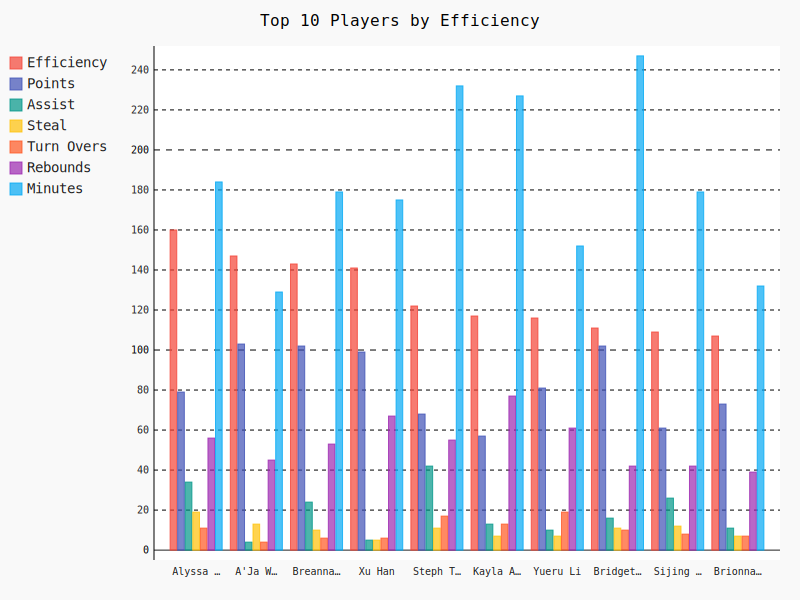

# Women Basket World Cup 2022 - All Players Data Analysis

## 1 get and save all players data to local
    https://www.fiba.basketball/womensbasketballworldcup/2022/playerstats
  python script : getPlayersData.py save output as 'women_basket_world_cup_2022_all_players.json'  
  

## 2 preprocessing data
   download file is json file, to use pandas library, we need convert json file to csv.\
   we need the following change for convert data.\
   1 add new column as Team.\
   2 add new column 'ReboundsTotal',get value from DefensiveReboundsTotal and OffensiveReboundsTotal

## 3 Player data analysis
### 3.1 top 10 player by efficiency 

### 3.2 Player Compare 
Top 5 China Player Compare

Han vs Li

Han vs Wilson

## 4 Team data analysis
Team China box data

Team USA box data

Team JPN box data

## 5 conclusion

