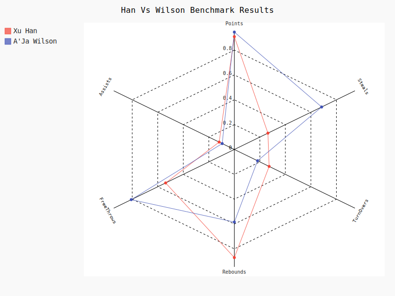
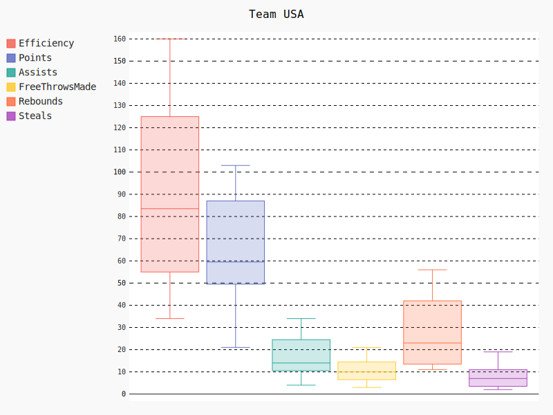

# Women Basket World Cup 2022 - All Players Data Analysis

## 1 Get and save all players data to local
    https://www.fiba.basketball/womensbasketballworldcup/2022/playerstats
  python script : getPlayersData.py save output as 'women_basket_world_cup_2022_all_players.json'  

## 2 Preprocessing data
   download file is json file, to use pandas library, we need convert json file to csv.\
   we need the following change for convert data.\
   1 add new column as Team.\
   2 add new column 'ReboundsTotal',get value from DefensiveReboundsTotal and OffensiveReboundsTotal

## 3 Player data analysis
### 3.1 Top 10 players by efficiency 

The graph is created based on the efficiency of the players. Efficiency is one of the most important critera to 
test a player's value, and it is culculated by a formula, which contains many different data from multiple aspects, 
so I chose this index to create the graph. Base on the graph, there are several conclusions we can get.\
First, most directly, we can see the ranking of the players based on efficiency and who were the top ten. \
Second, although the top one player has the highest efficiency, not all of her data is the top one of the game. For example, 
the total points her got was not the highest. This further reflects that efficiency is a comprehensive index.

### 3.2 Player Compare 
Top 5 China Player Compare

Han vs Li

Han vs Wilson

## 4 Team data analysis
Team China box data

Team USA box data

Team JPN box data

## 5 conclusion

